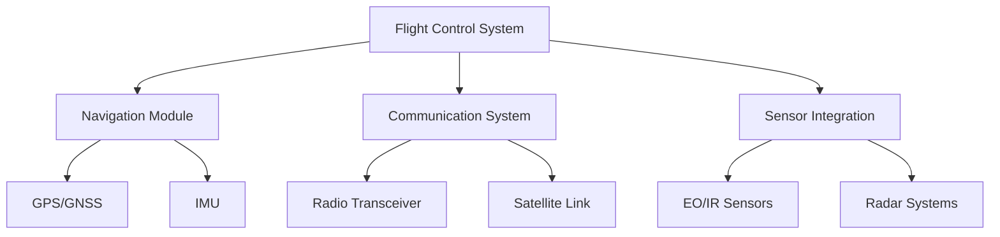

# MOSA Documentation - Military Drone System (MDS)

## Overview
**Military Drone System (MDS)** is a modular, open architecture unmanned aerial vehicle platform designed for reconnaissance, surveillance, and tactical operations. This document outlines the Modular Open Systems Approach (MOSA) implementation for the MDS.

## System Architecture

### 1. Physical Architecture

┌─────────────────────────────────────────────────────────────┐
│                    MDS Platform                             │
├─────────────────────────────────────────────────────────────┤
│  Payload Bay     │  Avionics Bay    │  Propulsion Section   │
├─────────────────────────────────────────────────────────────┤
│  [Modular]       │  [Standardized]  │  [Interchangeable]    │
└─────────────────────────────────────────────────────────────┘

### 2. Logical Architecture

## MOSA Compliance Matrix

| Requirement | Status | Implementation | Reference |
|-------------|--------|----------------|-----------|
| Modular Design | ✅ Compliant | Plug-and-play modules | DoD-STD-2525 |
| Open Interfaces | ✅ Compliant | REST APIs, DDS | IEEE 1451 |
| Standard Protocols | ✅ Compliant | STANAG 4607, Link-16 | NATO STANAGs |
| Backward Compatibility | ✅ Compliant | Version control system | MIL-STD-499 |

## Key Modules

### 1. Flight Control Module (FCM)
- **Module ID**: FCM-001
- **Version**: 2.3.1
- **Interface**: MIL-STD-1553B
- **Specifications**: 
  - Operating Range: -40°C to +70°C
  - MTBF: 5,000 hours
  - Weight: 2.3 kg

### 2. Communication Module (COMM-002)
- **Module ID**: COMM-002
- **Version**: 1.5.0
- **Interface**: Ethernet, RF
- **Specifications**:
  - Frequency Range: 2-6 GHz
  - Encryption: AES-256
  - Range: 150 km LOS

### 3. Sensor Payload Module (SPM-003)
- **Module ID**: SPM-003
- **Version**: 3.1.2
- **Interface**: Camera Link, USB 3.0
- **Specifications**:
  - Resolution: 4K at 60fps
  - Zoom: 30x Optical
  - Thermal Range: -20°C to +150°C

## Interface Standards

### 1. Hardware Interfaces

#### Power Interface

Pin 1: +28VDC (5A max)
Pin 2: Ground
Pin 3: +5VDC (2A max)
Pin 4: Ground
Pin 5: Signal Ground

#### Data Interface
- **Physical**: MIL-DTL-38999 Series III
- **Protocol**: Ethernet/IP
- **Bandwidth**: 10 Gbps
- **Latency**: < 1ms

### 2. Software Interfaces

#### API Endpoints

FlightControl:
  - /api/v1/flight/status
  - /api/v1/flight/control
  - /api/v1/flight/navigation

Sensors:
  - /api/v1/sensors/camera
  - /api/v1/sensors/radar
  - /api/v1/sensors/thermal

Communications:
  - /api/v1/comms/transmit
  - /api/v1/comms/receive
  - /api/v1/comms/status

## Security Architecture

### 1. Security Domains
- **Domain 1**: Flight Safety (Level 3)
- **Domain 2**: Mission Data (Level 4)
- **Domain 3**: Command & Control (Level 5)

### 2. Encryption Standards
- **Data at Rest**: AES-256
- **Data in Transit**: TLS 1.3
- **Key Management**: PKI X.509

### 3. Authentication
- **Multi-factor**: Smart Card + PIN + Biometric
- **Certificates**: DoD PKI
- **Session Management**: OAuth 2.0

## Integration Guidelines

### 1. Module Integration Process

1. **Compatibility Check**
   - Verify interface compliance
   - Validate power requirements
   - Confirm environmental specifications

2. **Installation**
   
   # Load module configuration
   mosaload --module FCM-001 --config flight_control.cfg
   
   # Verify integration
   mosaverify --module FCM-001 --test integration

3. **Testing**
   - Unit testing
   - Integration testing
   - System testing

### 2. Configuration Management

#### Module Registration

{
  "module_id": "FCM-001",
  "version": "2.3.1",
  "checksum": "SHA256:abc123...",
  "dependencies": ["NAV-001", "COMM-002"],
  "certifications": ["DO-178C Level A"]
}

## Maintenance and Support

### 1. Update Procedures

#### Firmware Update

   # Check current version
   mosacli --module FCM-001 --command version

   # Download update
   mosacli --command update --module FCM-001 --version 2.4.0

   # Apply update
   mosacli --command apply --module FCM-001

### 2. Diagnostic Capabilities

#### Health Monitoring
- Real-time performance metrics
- Predictive maintenance alerts
- Fault isolation and reporting

### 3. Lifecycle Management
- **Development**: Continuous Integration
- **Deployment**: Automated provisioning
- **Operations**: Remote monitoring
- **Decommission**: Secure data wipe

## Compliance and Certification

### 1. DoD Standards Compliance
- ✅ DoD Instruction 5000.02
- ✅ DoD-STD-2167A
- ✅ DI-MISC-85316

### 2. Safety Certifications
- ✅ DO-178C Level A (Flight Critical)
- ✅ DO-254 Level B (Hardware)
- ✅ MIL-STD-810G (Environmental)

### 3. Security Certifications
- ✅ NIST SP 800-171
- ✅ DFARS 252.204-7012
- ✅ CNSS Instruction 1253

## Performance Specifications

### 1. Operational Envelope
- **Altitude**: 0-15,000 ft
- **Speed**: 50-200 kts
- **Endurance**: 24 hours
- **Payload**: 50 kg maximum

### 2. Environmental Specifications
- **Temperature**: -40°C to +70°C
- **Humidity**: 5% to 95% RH
- **Vibration**: MIL-STD-810G
- **EMI/EMC**: DO-160G

## Documentation References

### 1. Primary Documents
- [MDS-TR-001] Technical Requirements Document
- [MDS-UM-002] User Manual
- [MDS-MM-003] Maintenance Manual

### 2. Standards References
- MIL-STD-1553B: Digital Time Division Command/Response Multiplexing
- STANAG 4607: NATO Secondary Imagery Format
- DO-178C: Software Considerations in Airborne Systems

## Contact Information

**Program Office**: PEO Aviation - Unmanned Systems
**Technical Support**: mosa-support@defense.gov
**Security Issues**: security@defense.gov

---

*This document is classified as UNCLASSIFIED//FOR OFFICIAL USE ONLY*  
*Last Updated: 2024-01-15*  
*Document Version: 1.2.3*